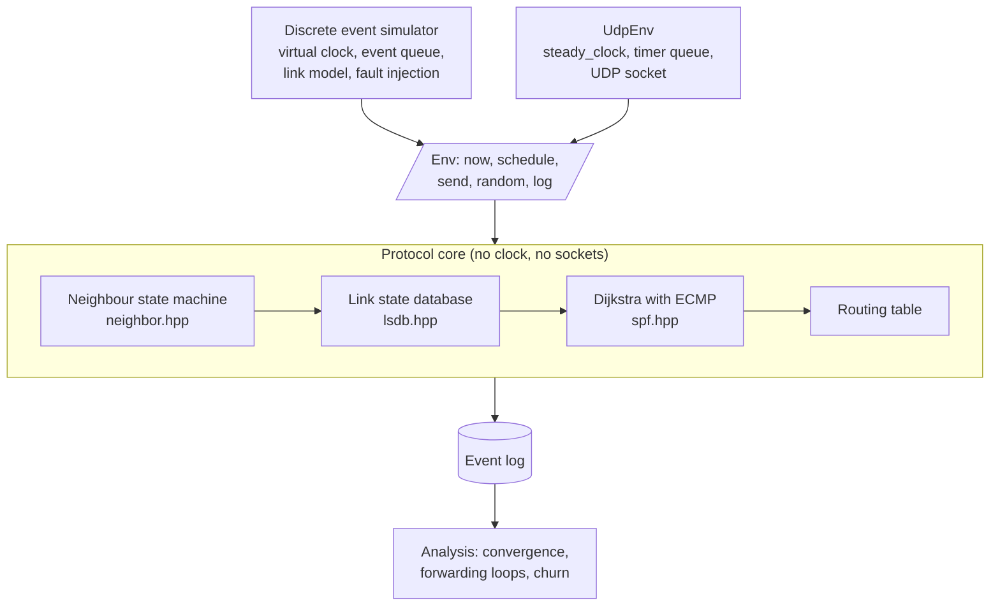

# Waypoint

Course project for **Mobile and Fixed Communication Networks**, MEng in Computer and Software
Engineering, Faculty of Computer Systems and Technologies, Technical University of Sofia.

## What it is

Waypoint is a link state routing daemon in the OSPF family, paired with a deterministic
discrete event network simulator. The same protocol code runs in both: against real UDP
sockets as a daemon, and against a virtual clock inside the simulator. The point is to make
routing convergence measurable. In a real network a link failure happens once, at a moment
nobody controls, so the interval between the failure and the moment every router agrees
again is hard to observe twice. Under a virtual clock the same failure replays identically,
which makes convergence time and transient forwarding loops something you can measure rather
than estimate.

## Goals

- Implement neighbour discovery, link state advertisement flooding, shortest path computation
  and route installation for a link state protocol in the OSPF family.
- Keep the protocol core free of any direct call to a clock or a socket, so one build of the
  logic serves both the daemon and the simulator.
- Make simulation runs bit for bit reproducible given the same topology, parameters and seed.
- Measure convergence time after a single link failure across topologies of increasing diameter.
- Detect transient forwarding loops and report their count and duration.

## Technologies

| Technology | Version or standard | Why |
|---|---|---|
| C++ | C++20 (ISO/IEC 14882:2020) | Deterministic resource lifetime, no runtime scheduler or garbage collector to perturb timing measurements. |
| CMake | 3.20 or newer | One build description that has to produce the same result on Windows, Linux and macOS. |
| BSD sockets and Winsock | platform native | Live mode talks to real interfaces. Both sit behind one internal interface rather than in the protocol code. |
| Graphviz (DOT) | any | Topology and computed shortest path graphs are written as DOT for inspection. Output only, not a build dependency. |

**There are no third party dependencies.** No package manager, no network access at configure
time, nothing to install. A C++20 compiler and CMake are the whole requirement. The test
runner is 132 lines of assert macros in `tests/check.hpp` and `tests/check.cpp`, registered
with CTest; the timing harness uses `std::chrono::steady_clock` directly.

## Architecture

The protocol core holds the neighbour table, the link state database and the route computation.
It never reads a clock and never touches a socket. Instead it asks one interface, `Env`, for the
current time, for timer scheduling, for message delivery and for randomness. In the simulator
that interface is backed by an event queue with a virtual clock, so nothing advances except by
dequeuing the next event. In the daemon it is backed by the monotonic system clock and a UDP
socket. Both modes emit the same event log, and one analysis pass computes convergence time and
loop intervals from routing tables alone.



| Directory | What is in it |
|---|---|
| `include/waypoint/`, `src/` | The library. `packet` wire format, `lsdb`, `spf`, `neighbor` state table, `router` protocol core, `topology`, `sim` simulator, `analysis`, `udp` live transport. |
| `apps/` | `waypoint-demo`, `waypoint-bench`, `waypoint-live`. |
| `tests/` | The test runner and eight suites, 70 cases. |
| `topologies/` | Sample topology files. |
| `docs/` | The project report, in LaTeX. |

## Build

Verified with GCC 15.2.0 (MinGW-w64) and CMake 4.3.2 on Windows 11, and portable to Linux and
macOS: nothing outside the standard library and the platform socket headers is used.

```bash
git clone <repository-url> waypoint-communication-networks
cd waypoint-communication-networks
cmake -S . -B build -G Ninja -DCMAKE_BUILD_TYPE=Release
cmake --build build
```

Leave out `-G Ninja` to use the default generator. The build produces `libwaypoint`, three
executables and the test binary, with no warnings under `-Wall -Wextra -Wpedantic`.

## Test

```bash
ctest --test-dir build --output-on-failure
```

Eight suites, 70 cases, covering the wire format including malformed input, sequence number
comparison across the wrap, database ageing and withdrawal, Dijkstra with equal cost multipath,
every transition of the adjacency state machine, the topology generators and file parser, the
loop and convergence analysis, whole network convergence in the simulator, fault injection of
all three failure types, byte for byte reproducibility, and two routers forming an adjacency
over real UDP sockets on the loopback interface.

To run one suite directly: `./build/waypoint-tests sim`.

## Run the demonstration

```bash
cmake --build build --target demo
```

or equivalently `./build/waypoint-demo --out dot`. It brings a twelve node ring up, waits for
every routing table to agree with Dijkstra on the true topology, fails the link between nodes 6
and 7 at 40 s of virtual time, and prints when each router noticed, when it recomputed and when
it installed the new table, followed by the reconvergence time, the transient loop interval, the
flooding cost and the route churn. It then repeats the whole run and compares the event log
digest, which must be identical. Finally it writes DOT files for the topology before and after,
and for the shortest path graph rooted at node 1 before and after:

```bash
dot -Tpng build/dot/topology-after.dot -o after.png
```

## Run the measurements

```bash
./build/waypoint-bench --csv results.csv
```

Four experiments: convergence against network size, convergence against the hello and dead
intervals, flooding overhead against topology density, and transient loop count against failure
type. Ten repetitions per case, each repeated a second time and rejected unless the event log
digest matches. Takes about eight seconds.

## Run live, over real sockets

Each router is one process, listening on `base-port + its own id`.

```bash
./build/waypoint-live --topology topologies/line3.txt --id 1 --seconds 30 &
./build/waypoint-live --topology topologies/line3.txt --id 2 --seconds 30 &
./build/waypoint-live --topology topologies/line3.txt --id 3 --seconds 30 &
```

Each process prints its adjacency states, database size and routing table every five seconds.
In `line3.txt` the direct link from 1 to 3 costs 50 and the path through node 2 costs 20, so a
correct run shows node 1 reaching node 3 via node 2.

## Topology file format

```
name ring12
node 7                                  # optional, endpoints of a link are implied
link 1 2 cost 10 delay 1000 bw 100000000
```

`cost` is the metric, `delay` the one way propagation delay in microseconds, `bw` the bandwidth
in bits per second. All three are optional. A line that does not parse is refused with its line
number rather than being skipped.

## Documentation

The project report lives in `docs/`. It is written in Bulgarian, because the subject is taught
in Bulgarian and the layout rules are normative for the faculty. Build it with:

```bash
cd docs
latexmk -pdf Main.tex
```

The output is `docs/build/Main.pdf`. Unfilled facts are marked with `\TODO{...}` and are found
with:

```bash
grep -rn 'TODO' docs/chapters docs/Main.tex
```

## Status

- [x] Repository scaffold
- [x] Report skeleton in the required format
- [x] CMake build description, no third party dependencies
- [x] Time and transport abstraction (`Env`)
- [x] Neighbour discovery and adjacency state machine
- [x] Link state database, sequence numbers, ageing and withdrawal
- [x] Reliable flooding with duplicate suppression, acknowledgement and retransmission
- [x] Dijkstra with equal cost multipath, and the both ends rule for one way links
- [x] Route installation as a step separate from the computation
- [x] Discrete event simulator, virtual clock, link delay, bandwidth and queueing
- [x] Fault injection: link down and up, node failure, one way link failure
- [x] Event log and analysis: convergence, forwarding loops, flooding overhead, churn
- [x] Topology file format and generators for ring, grid mesh, full mesh and fat tree
- [x] Graphviz output of the topology and the shortest path graph
- [x] Live mode over UDP, portable across Windows and POSIX
- [x] Measurements
- [ ] Interoperability check against an existing daemon such as FRRouting or BIRD

The interoperability check has not been carried out. Waypoint's packet format is its own, not
the OSPFv2 format of RFC 2328, so an existing daemon would not parse it; making that check
possible means implementing the OSPFv2 encoding, which is a separate piece of work. The report
says so where it matters rather than implying otherwise.

## License

MIT. See [LICENSE](LICENSE).
