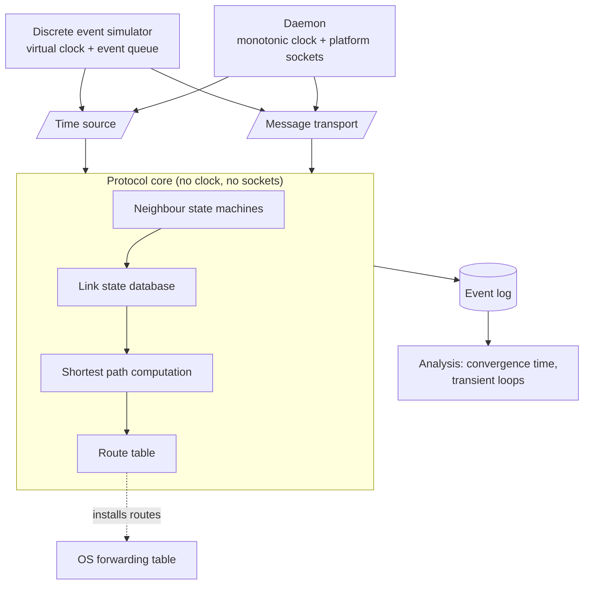

# Waypoint

Course project for **Mobile and Fixed Communication Networks**, MEng in Computer and Software
Engineering, Faculty of Computer Systems and Technologies, Technical University of Sofia.

## What it is

Waypoint is a link state routing daemon in the OSPF family, paired with a deterministic
discrete event network simulator. The same protocol code runs in both: against real sockets
as a daemon, and against a virtual clock inside the simulator. The point is to make routing
convergence measurable. In a real network a link failure happens once, at a moment nobody
controls, so the interval between the failure and the moment every router agrees again is
hard to observe twice. Under a virtual clock the same failure replays identically, which
makes convergence time and transient forwarding loops something you can measure rather than
estimate.

## Goals

- Implement neighbour discovery, link state advertisement flooding, shortest path computation
  and route installation for a link state protocol in the OSPF family.
- Keep the protocol core free of any direct call to a clock or a socket, so one build of the
  logic serves both the daemon and the simulator.
- Make simulation runs bit for bit reproducible given the same topology, parameters and seed.
- Measure convergence time after a single link failure across topologies of increasing diameter.
- Detect transient forwarding loops and report their count and duration.
- Verify wire and route correctness against an existing routing daemon, not performance.

## Technologies

| Technology | Version or standard | Why |
|---|---|---|
| C++ | C++20 (ISO/IEC 14882:2020) | Deterministic resource lifetime, no runtime scheduler or garbage collector to perturb timing measurements. |
| CMake | 3.20 or newer | One build description that has to produce the same result on Windows, Linux and macOS. |
| GoogleTest | 1.14 or newer | The neighbour state machine is a table of transitions; each transition gets its own test. |
| BSD sockets and Winsock | platform native | Live mode talks to real interfaces. Both sit behind one internal interface rather than in the protocol code. |
| Graphviz (DOT) | 2.40 or newer | Topology and computed shortest path trees render to DOT for inspection. Output only, not a build dependency. |
| FRRouting or BIRD | reference only | Interoperability check for packet formats and computed routes. Correctness reference, never a performance baseline. |

## Architecture

The protocol core holds the neighbour table, the link state database and the route computation.
It never reads a clock and never touches a socket. Instead it asks two interfaces for the current
time and for message delivery. In the simulator those interfaces are backed by an event queue with
a virtual clock, so nothing advances except by dequeuing the next event. In the daemon they are
backed by the monotonic system clock and the platform socket layer. Both modes emit the same event
log, and one analysis pass computes convergence time and loop intervals from that log alone.



## Build

The build description is not in place yet, so these commands are the intended shape rather than
something that works today. See Status below.

```bash
git clone <repository-url> waypoint-communication-networks
cd waypoint-communication-networks
cmake -S . -B build -DCMAKE_BUILD_TYPE=RelWithDebInfo
cmake --build build --parallel
ctest --test-dir build --output-on-failure
```

## Documentation

The project report lives in `docs/`. It is written in Bulgarian, because the subject is taught
in Bulgarian and the layout rules are normative for the faculty. Build it with:

```bash
cd docs
latexmk -pdf Main.tex
```

The output is `docs/build/Main.pdf`. Formatting follows the TU-Sofia Faculty of Computer Systems
and Technologies document format: A4, Times metrics at 12pt, 1.5 line spacing, Roman numbered
sections, tables captioned above and figures captioned below. Unfilled facts are marked with
`\TODO{...}` and are found with:

```bash
grep -rn 'TODO' docs/chapters docs/Main.tex
```

## Status

- [x] Repository scaffold
- [x] Report skeleton in the required format
- [ ] CMake build description
- [ ] Time and transport abstraction
- [ ] Neighbour discovery and adjacency state machine
- [ ] Link state database and flooding
- [ ] Shortest path computation
- [ ] Route installation, per platform
- [ ] Discrete event simulator and virtual clock
- [ ] Event log format and analysis pass
- [ ] Topology set and failure scenarios
- [ ] Interoperability check against the reference daemon
- [ ] Measurements and results

Nothing under `src/`, `include/` or `tests/` is implemented yet. The report chapters exist as
skeletons with the experimental plan stated and no numbers in them.

## License

MIT. See [LICENSE](LICENSE).
